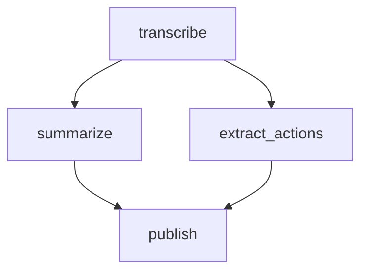

# Scenario catalog

Reference recipes for **scenarios** — multi-pipeline runs that chain the
workspace's pipelines together. Each entry is a *blueprint*: it describes a flow
that has worked (or is meant to), so the next time someone needs that flow an
agent builds the concrete run from the recipe instead of re-discovering it. This
is the "reach for what exists first" source for chaining, the way the pipeline
catalog is for single tasks.

Two related places — don't confuse them:

- **Here (`.hq/scenarios/`)** — committed, durable **references**. The recipe.
- **`.hq/_runtime/scenarios/<dd-mm-hhmm-slug>/`** — ephemeral **instances**: the
  actual script, working files, and post-run report for one execution.

A runtime instance that proves itself graduates into a reference here; a
reference here is the starting point for the next runtime instance.

## What an entry is

A markdown doc per scenario — a flat `<slug>.md`, or a `<slug>/` directory when
it carries companion files (sample inputs, helper snippets). Write it
skill-like: lead with what the scenario accomplishes and when to reach for it,
then whatever helps someone reproduce it — input mapping, per-pipeline notes,
gotchas, the steps that tend to fail and how to resume them. Include pretty much
anything useful.

These are **references, not invokable skills** — they live here, not under
`.agents/skills/`, so they aren't surfaced as agent skills. The `scenario` skill
reads them.

## Required: a mermaid flow diagram

Every entry **must** contain a mermaid diagram of the pipeline flow, because the
one thing a recipe has to make unambiguous is **what runs in parallel and what
runs in sequence**. Use a `flowchart`: each pipeline is a node; an arrow means
"must finish before". Nodes with no path between them run concurrently; a chain
of arrows runs in order.

Read that as: `transcribe` first; then `summarize` and `extract_actions` run in
parallel; `publish` waits for both. That is exactly the shape the generated
`scenario.ts` mirrors — sequential `step`s vs. parallel branches in a
`Promise.all`.

Label the nodes by pipeline **role**, not by pinned ids or flags: the diagram is
about the *flow*. The concrete ids and input shapes come from the `explore` /
`run` skills and each pipeline's own schema when the run is actually built, so
the recipe doesn't go stale when those change.
