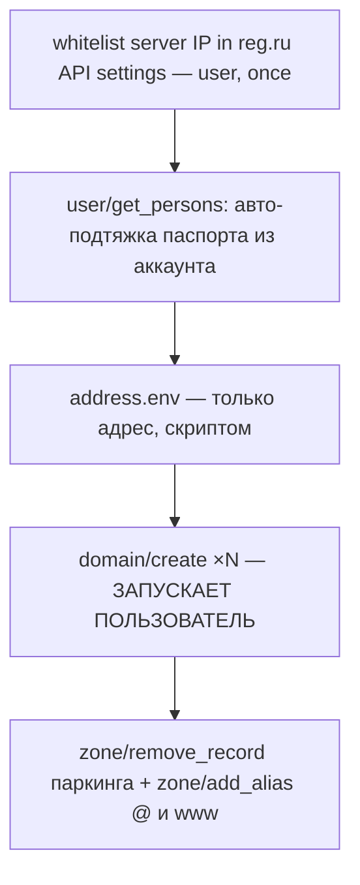

# Buy domain — регистрация .ru через reg.ru API + A-записи

> **Status: PROVEN (3 домена куплены 2026-07-03).** Scripts live on the deploy
> host `/opt/sites-deploy/`: `register_domains.sh` (+ `set_address.sh`),
> reference copies in `.hq/_runtime/scenarios/03-07-deploy/`.

## What it accomplishes

Registers .ru domains on the user's reg.ru account (prepaid balance) and points
`@`/`www` A-records at the server — one script run. Passport data flows
account→reg.ru: the script pulls the saved person from the account, the agent
never touches it.

## The flow

## Hard-won gotchas

- **API auth = логин+пароль (отдельный API-пароль), токенов нет.** Работает
  ТОЛЬКО с IP из whitelist («Настройки API → Диапазоны IP») — добавь IP
  сервера; локальная машина с динамическим IP бесполезна.
- **`domain/check` — только для реселлеров**; цену бери из
  `domain/get_prices` (retail .ru ≈169₽ рег., ~1199₽ продление).
- **Контакты физлица — ТОЧНЫЕ имена полей** (см. официальный пример
  `domain/create`): `person_r_surname/name/patronimic`, `person_surname/...`
  (латиница), `passport_series`, `passport_number_short`, `passport_place`,
  `passport_place_id`, `passport_date`, `birth_date` — даты в **ДД.ММ.ГГГГ**;
  адрес по частям `p_addr_zip/city/street/house/frame/building/flat`;
  `country`, `code:""`, `is_entrepreneur:0`. Иначе `INVALID_CONTACTS`.
  Сводный `person_r`/`passport`/`p_addr` одной строкой — НЕ работает.
- **`UNKNOWN_CONTYPE`** = аккаунт без заполненного регистранта; после
  заполнения контактов/идентификации в UI появляется персона —
  **`user/get_persons`** отдаёт её поля (person_id, паспорт) → скрипт мапит их
  в контакты create. Пользователю остаётся ввести только адрес.
- **Финальную команду (`DO_REGISTER=1 ./register_domains.sh`) запускает
  ПОЛЬЗОВАТЕЛЬ** — она подаёт его паспорт и тратит деньги; агент готовит всё
  до и делает всё после, но эту команду не исполняет. Это граница, не баг.
- **A-записи**: правильная функция — `zone/add_alias`
  (`{domains:[{dname}],subdomain:"@"|"www",ipaddr}`); `zone/add_a` не
  существует. Свежий домен приходит с **парковочными A** (95.163.244.138) —
  сначала `zone/remove_record`, иначе паркинг перебивает.
- Неудачный `domain/create` денег НЕ списывает — пробовать безопасно.
