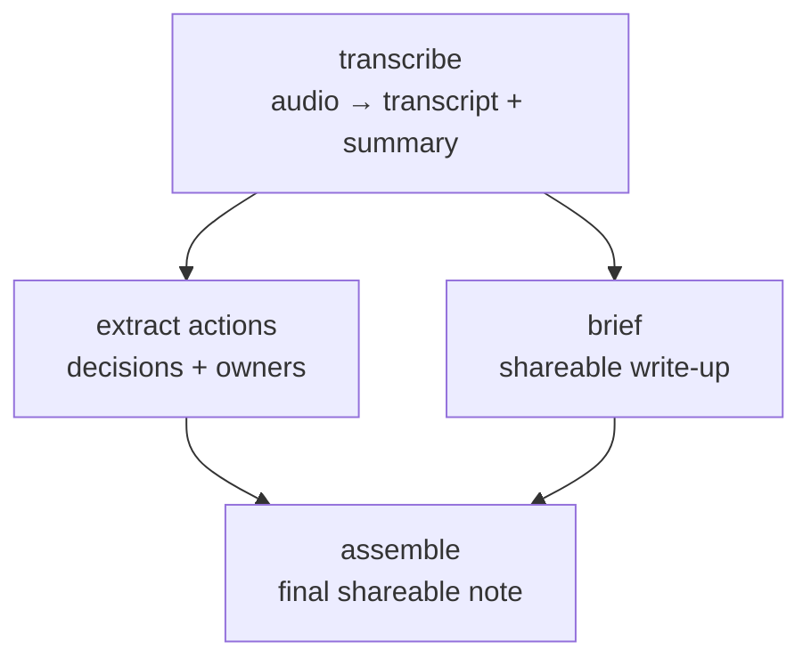

# Call → brief

Reach for this when someone hands you a recording and wants the usual
post-meeting package: "make notes from this call", "what did we decide and who
owns what", "write this up so I can share it". One audio file in; a transcript,
an action-item list, and a polished brief out.

## Flow

`transcribe` runs first — everything depends on its output. Once the transcript
exists, **`actions` and `brief` run in parallel** (they only read the
transcript, not each other). `assemble` is the join: it waits for both before
merging them into the final note.

## Roles → pipelines

The diagram is the stable part; which pipeline plays each role can change, so
confirm the current id and input schema with the `explore` skill before
building the run.

| role        | pipeline (confirm with `explore`) | does                                                     |
|-------------|-----------------------------------|----------------------------------------------------------|
| transcribe  | `call-transcribe`                 | audio → diarized transcript + summary                    |
| extract actions | `agent`                       | reads the transcript, pulls decisions / action items / owners (QA-gated) |
| brief       | `showcase`                        | turns the summary into a structured, shareable brief     |
| assemble    | `agent`                           | merges the brief + action items into one final note      |

## Inputs

- **A recording** (audio file path or URL) is the only required external input.
- Everything downstream is **derived**: each step reads the prior step's output
  from the run's `outputs/` dir. Capture `transcribe`'s output path and pass it
  as the input to both middle steps; capture theirs and pass both to `assemble`.
- Build each step's input to match that pipeline's own schema
  (`--print-schema`), not a remembered shape — the `agent` prompt especially is
  yours to write per run.

## Notes & gotchas

- **`transcribe` is the bottleneck and the most failure-prone** — long audio,
  odd formats, transient model errors. It's the step you'll resume from most;
  keep it as its own checkpoint so a downstream failure never re-transcribes.
- **The two middle steps are independent — actually parallelize them** (`&` …
  `wait`). They're the whole reason this is a scenario and not a straight line.
- **`showcase` has an approval gate** that blocks on human approval. In an
  unattended run, pass a small approval timeout so it auto-continues instead of
  hanging — check its schema for the current flag name rather than assuming it.
- **`assemble` is a plain `agent` run** with a prompt that stitches the two
  inputs together; treat its prompt as the place you'll iterate most between
  attempts.

## Resume points

Natural checkpoints, in order: `transcribe` → (`actions` ‖ `brief`) →
`assemble`. A failure in either middle branch or in `assemble` should re-run
without re-transcribing; a failure in `assemble` should re-run without redoing
either branch. If you find yourself re-running `transcribe` to fix the brief,
the checkpoints are wrong.
