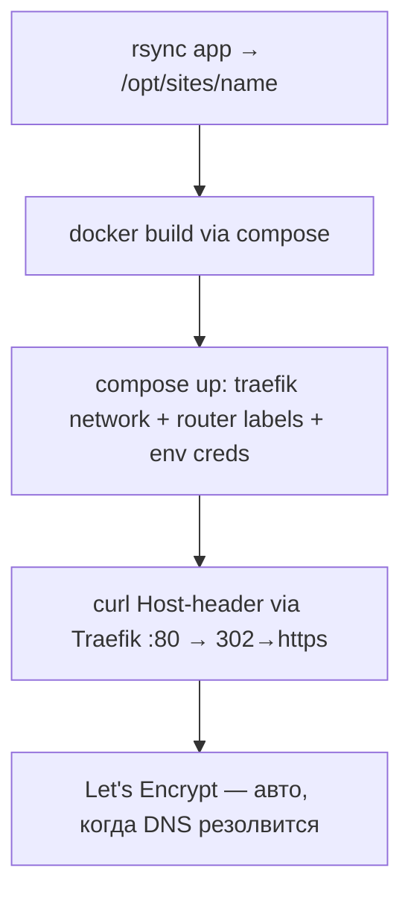

# Deploy site — a built web MVP onto the shared host (Traefik mode)

> **Status: PROVEN (3 sites live 2026-07-03/04).** Driver:
> `.hq/_runtime/scenarios/03-07-deploy/deploy_traefik.sh <product> <domain>`
> (idempotent — rerun to redeploy). The older port-mode `deploy.sh` is
> superseded; keep it only for hosts without Traefik.

## What it accomplishes

Takes a built MVP from `projects/<name>/worktrees/main` and puts it LIVE on the
shared host behind the EXISTING Traefik with its domain and auto-HTTPS
(Let's Encrypt). Runtime creds (ЮKassa keys) are injected as env — nothing in
code/images. Rerun = clean redeploy.

## The flow

## Hard-won gotchas (each cost real debugging time)

- **The host runs a PROD stack (yume) behind Traefik on :80/:443.** NEVER
  install nginx or bind :80 — nginx will fail `bind() 98` and could fight the
  prod proxy. Route ONLY by joining the `traefik` docker network + labels.
- **Labels via docker-compose YAML, not inline `docker run`** — Host(`…`)
  backticks + arrays are unquotable through ssh/bash; a compose file with
  __PLACEHOLDER__ substitution is the reliable path.
- **Multibyte arrow glued to a var** (`[$PRODUCT→…`) makes bash treat `→` as
  part of the variable name → `unbound variable`. Always `${VAR}`.
- **Empty bash arrays under `set -u`**: expand as
  `${ARR[@]+"${ARR[@]}"}`, never `${ARR[*]}`.
- **reg.ru puts PARKING A-records on fresh domains** (95.163.244.138) — your
  `zone/add_alias` coexists with them and parking wins. Remove via
  `zone/remove_record` (subdomain/type/content), then add yours.
- **Let's Encrypt while DNS propagates**: ACME fails with NXDOMAIN and backs
  off; LE also negative-caches. Wait until the domain resolves globally
  (8.8.8.8 + 1.1.1.1), mind the ~5-fails/hour/hostname limit, then
  `docker restart traefik` to force a fresh attempt (existing certs persist
  in acme.json; prod blinks ~3s).
- **Creds flow**: everything from gitignored `.hq/_runtime/golive.env`,
  passed as compose `environment:` — never into the repo or image.

## Per-site env

`YOOKASSA_SHOP_ID/SECRET_KEY` (test → test payments; live → real money, same
build), product flags (e.g. `NASLEDSTVO_PAYMENT_BYPASS=0`).
