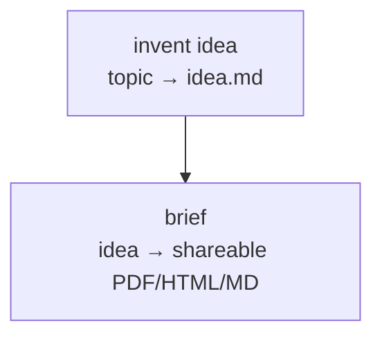

# Idea → brief

Reach for this when someone wants a product idea *and* a write-up but hands you
nothing to start from: "come up with a small product idea and turn it into a
brief", "invent something and make me a one-pager", "give me a polished concept
to share". No external input required — the first step invents the seed.

If the user already has the idea, skip the first step and run the brief pipeline
alone (use the `run` skill) — it's only a scenario when both halves run.

## Flow

Straight line: `brief` strictly consumes `invent`'s `idea.md`. No parallel
branches. (The brief pipeline may itself fan out internally across providers —
that's one run, not a scenario branch.)

## Roles → pipelines

Confirm current ids/schemas with the `explore` skill before building — the
diagram is the stable part.

| role   | pipeline (confirm with `explore`) | does                                                        |
|--------|-----------------------------------|-------------------------------------------------------------|
| invent | `idea-gen`                        | optional `topic` → a short product idea in `idea.md` (cheap model) |
| brief  | `showcase`                        | seed idea → multi-section brief, renders PDF + HTML + MD     |

## Inputs

- **None external.** Optionally seed `invent` with `args.topic` to steer the
  idea's domain (leave default for a free invention).
- **Pass the idea through explicitly.** The brief pipeline defaults its `idea`
  arg to `"auto"` and will invent its *own* idea if you don't feed it one. Read
  `idea-gen`'s `idea.md` and pass its full text as the brief pipeline's `idea`
  arg so the brief is built around the idea you just invented.

## Notes & gotchas

- **Schema flag is `--print-schema`** (not `--schema`). The pipeline CLI takes
  only `--help`, `--print-schema`, `--input`.
- **Run name lives inside `--input` JSON** as the top-level `run` field — this
  runner has no `--run` CLI flag. Build the JSON with a tiny `python3 json.dumps`
  to embed the idea text safely; give each step a stable, unique run name
  (`<slug>-invent`, `<slug>-brief`).
- **Approval gate:** `showcase` pauses on `008-approval` for an external signal.
  In an unattended run pass a small `approvalTimeoutSec` (e.g. 5) so it
  auto-approves instead of hanging.
- **Aggregator may fall back:** `007-aggregate` can log "Failed to validate JSON
  … falling back to deterministic concat" and still ship a valid brief with all
  sections — it just concatenates instead of LLM-merging. Non-fatal; re-run
  `from=007-aggregate` if you want a tighter narrative.
- **Idea name drifts:** `showcase`'s `001-seed` re-brands the seed even when you
  pass an idea in — the *concept* carries through faithfully but the *title* does
  not. Observed: `idea.md`'s "ClipBoard Pro" shipped as "ClipMate Pro" (slug
  `clipmate-pro`). Don't expect step 1's exact name to survive into the brief.
- **Demo framing:** `showcase` is a capability demo and stamps each section with
  the provider that wrote it. Fine for a concept brief; if you want a clean,
  un-attributed brief, point the `brief` role at a dedicated brief pipeline when
  one exists — the diagram doesn't change.

## Resume points

`invent` → `brief`. A `brief` failure re-runs without re-inventing the idea
(`idea.md` is checkpointed). If only aggregation/render needs redoing, resume
the brief pipeline by step id (`from=007-aggregate`) rather than the whole run.
