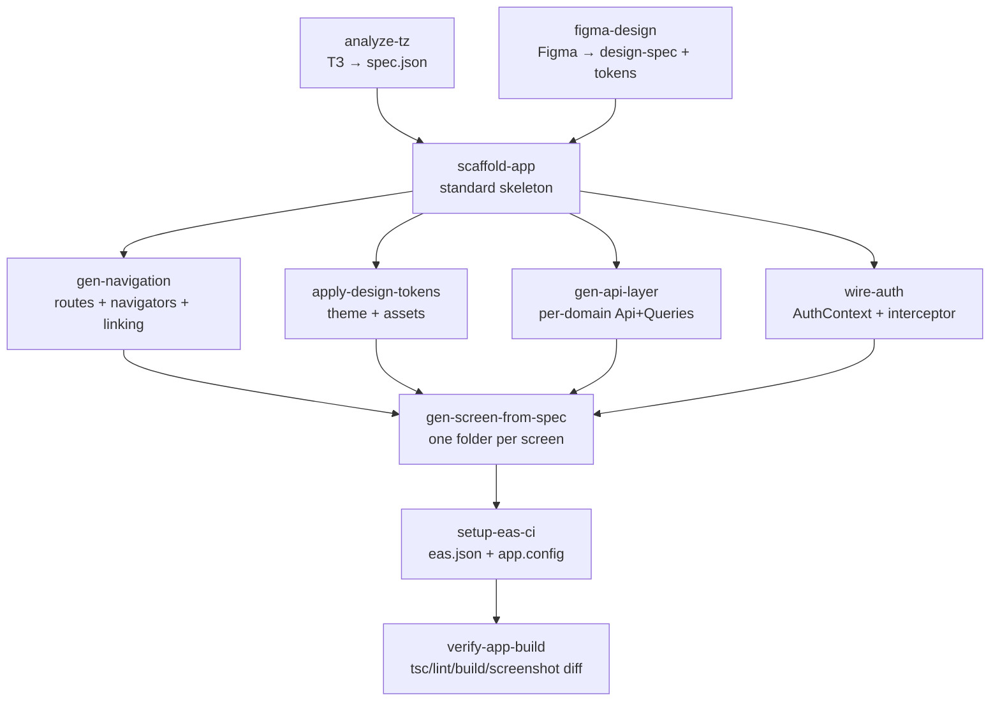

# Scenario (DRAFT): new-mobile-app — «фабрика мобилок»

> Discovery-черновик из анализа eclion + osmix (Expo/React Native). Не закоммичен как проверенный рецепт — это карта для Фазы 1. Закаляется по мере реализации пайплайнов.

> **Update 2026-06-13 (d) — реализован `verify-app-build`** (QA-гейт совместимости, кандидат #11). Берёт N file-map'ов генераторов (scaffold + gen-api-client + …) → материализует во временное приложение → РЕАЛЬНЫЙ `bun install --ignore-scripts` → `tsc --noEmit` на родном tsconfig (настоящие типы Expo/RN) → verdict.json {ok, installOk, typecheckOk, errors}. Кодифицирует ручную проверку, поймавшую mmkv v4-vs-v3 — теперь совместимость проверяется ВСЕГДА, а не на стабах. Это финальный гейт сценария; принимает maps аргументом, поэтому проверяет реальную КОМПОЗИЦИЮ. Доказанный срез на VenusX: scaffold(34, mmkv ^3.3.0) + api(20) → install + tsc чисто.

> **Update 2026-06-13 (c) — реализован `scaffold-app`** (foundation). Детерминированный (без LLM) генератор стандартного Expo/RN-скелета из spec.json: конфиги (package.json, app.config.ts, tsconfig, babel, metro+svg, eas.json 3 профиля) + ядро src/ (Providers tree, MMKV general+secure, axios+single-flight refresh, React Query persist, Theme/Auth контексты, токен-тема createStyles, i18n ru-default, ScreenContainer/Button/AppText, nav-гейт). Имя/bundle (com.whyti.<slug>)/scheme/локали из spec; divergence-дефолты из config (nav=flat, auth=mock, theme=system). Выход files.json (34 файла). Проверено: все .ts/.tsx через Bun.Transpiler, все .json валидны. На VenusX → com.whyti.venusx. gen-api-client'овский src/api/ ложится поверх. Арка: analyze-tz → merge-spec-design → {scaffold-app, gen-api-client}.

> **Update 2026-06-13 (b) — реализован FE-codegen `gen-api-client`** + политика сверки. Из `build-contract.json` детерминированно (без LLM) генерится типизированный фронт-API-слой (types из dataModel, axios-клиент+bearer, сервисы по доменам — 1 функция/операция, React Query хуки) как files.json (path→content). Проверено `tsc --strict` (21 файл, чисто). Это первый из gen-* потребителей контракта. Митигация расхождений зашита в `merge-spec-design` 002-align (`reconciliation`): design-only → авто-adopt (строим из дизайна), ТЗ-only → covered_by_design если домен есть в дизайне, иначе gap. На VenusX: 35 design-only приняты, 16 ТЗ-only → 14 covered, 2 реальные дыры (Боковое меню, Избранное) на доработку дизайна.

> **Update 2026-06-13 — реализован JOIN-stage `merge-spec-design`.** Между фронт-стадиями (`analyze-tz` ‖ Figma) и генерацией кода появился пайплайн-сшиватель: вход — `spec.json` (analyze-tz) + `inventory.json` (Figma-пайплайн, живёт вне этого workspace; его деплой-инвентарь — напр. venusx-inventory.netlify.app). Шаги: 001-load → 002-align (coverage-отчёт design↔ТЗ) → 003-contract (**keystone**: `openapi.json` + `schema.sql`, тела запросов/ответов выведены слиянием эндпоинтов Figma ⨝ сущностей ТЗ) → 004-screens (per-screen FE build-spec) → 005-qa (revise-loop). Выход `build-contract.json` (OpenAPI) — единый шов FE↔BE: и фронт-, и бэк-генерация строятся против него. Решение по конфликтам: **Figma — источник истины по UI/эндпоинтам, ТЗ — по модели данных.** Прогнан на VenusX (33 операции, 15 таблиц, QA ok). Это уточняет схему ниже: `scaffold-app` больше не «джойн» — джойн делает `merge-spec-design`, а scaffold/gen-* (FE) и новая бэк-дуга потребляют его контракт.

## 1. Эталон мобильной архитектуры

## Canonical "Our Standard Mobile App" (distilled from OSMIX + ECLION)

Both apps are Expo SDK 54 / RN 0.81.5 / React 19.1 / TS-strict React Native apps owned by `digiterium`, sharing a near-identical skeleton. That overlap IS the standard. Below, **AGREE → adopt as the factory default**; **DIVERGE → a decision the template must pin** (see openQuestions).

### Foundation — AGREE (adopt verbatim)
- **Runtime**: React Native 0.81.5, React 19.1.0, Expo SDK ~54, TypeScript strict, New Architecture (Fabric) enabled.
- **Path alias**: `@/* → src/*` via tsconfig paths + `babel-plugin-module-resolver`. All imports use `@/...`.
- **Navigation**: `@react-navigation/native` v7 — native-stack + bottom-tabs; `routes.ts` holds all typed ParamLists; deep linking via `expo-linking` with a custom `scheme://` (+ `https://` universal link); `NavigationContainer` themed from `useTheme()` to avoid white blink (eclion's `NavigationTheme` pattern — adopt for both).
- **Server state**: TanStack React Query v5; `src/config/queryClient.ts` owns the `QueryClient`.
- **Client state**: Zustand v5 (persist to MMKV via `createJSONStorage` + an MMKV adapter only when state must survive restart, with granular selector hooks); React Context reserved for cross-cutting Auth + Theme only.
- **Local persistence**: `react-native-mmkv` v4, **no AsyncStorage**. Convention: a general instance + a separate **secure/encrypted** instance for tokens (eclion's `eclion-storage` / `eclion-secure`; osmix's named ids `osmix-auth`/`osmix-user-session`). MMKV is synchronous — read/write without await.
- **HTTP**: single Axios singleton `src/api/client.ts` (15s timeout, JSON) with **request interceptor** (inject `Authorization: Bearer <access>`) + **response interceptor** (single-flight 401 → `auth/refresh` → retry once via `_retry`; on failure clear tokens + fire a module-level `sessionExpiredHandler` wired by `AuthContext` to logout/reset nav). Access token in-memory or secure-MMKV, **refresh token in secure MMKV**.
- **Theming**: token-based. `src/theme/` = `themes.ts` (light + dark `ThemeColors`), `types.ts`, `typography.ts` (font family map + FONT_SIZE/WEIGHT/LINE_HEIGHT scales matching Figma), `spacing.ts` (SPACING xxs..xxl), `layout.ts`, `index.ts` barrel. **Mandatory pattern**: styles are factory functions `createStyles(colors: ThemeColors)`, consumed as `const {colors}=useTheme(); const styles=useMemo(()=>createStyles(colors),[colors])`. **Never** read raw colors or `StyleSheet.create` inline in a component file; **never** hardcode hex in new code.
- **Co-location**: one folder per screen and per component; component/screen impl in `<Name>.tsx`, styles in sibling `<name>.styles.ts`. Recursive screen-folder rule: a folder with >1 screen → subfolder-per-screen.
- **Shared components first**: reuse `ScreenContainer` (wraps SafeAreaView — never use SafeAreaView directly), `Button` (with `loading` prop — never raw Touchable for primary actions), `AppInput`, `AppHeader`, `AppDropdown`, `AppText`/typography variants, bottom sheets. Extract a new shared component only at 2+ call sites.
- **i18n**: `i18next` + `react-i18next`, **default/fallback `ru`**, `en` mirror; every user-visible string via `t('feature.screen.key', 'Русский дефолт')` with inline Russian default; persisted language in MMKV.
- **Provider composition**: a single `src/app/Providers.tsx` tree, order matters: `SafeAreaProvider → GestureHandlerRootView → ThemeProvider → BottomSheetModalProvider → QueryClientProvider → AuthProvider`, `ToastWithConfig` sibling after Auth; `i18n` imported for side-effect first. Entry `index.ts → App.tsx → Providers → NavigationContainer → RootNavigator`; `RootNavigator` gates Auth vs Main on auth loading state.
- **Native/UI libs (shared core)**: `react-native-reanimated` v4 + worklets, `react-native-gesture-handler`, `@gorhom/bottom-sheet` v5, `react-native-safe-area-context`, `react-native-svg` + `react-native-svg-transformer` (metro: svg moved assetExts→sourceExts; SVGs imported as components with `currentColor` for theming), `react-native-toast-message`, `expo-linear-gradient`, `expo-font`.
- **Build/release**: Expo + EAS Build/Submit, `eas.json` with three profiles — `development` (devClient, internal, apk, iOS simulator), `preview` (internal apk), `production` (autoIncrement, `appVersionSource: remote`, m-medium/medium resource class); `submit.production` wired to App Store (`ascAppId`, `appleTeamId RA3JN7VEY3`) + Google Play (internal track, draft). `app.config.ts` is the authoritative dynamic config; bundle pattern `com.whyti.<app>`, owner `digiterium`. `EXPO_PUBLIC_*` for public build-time vars surfaced via `src/config/env.ts` + `expo.extra`.
- **Domain API layer**: per-domain folder under `src/api/services/<domain>/` — `<domain>Api.ts` (axios calls + typed request/response interfaces + envelope extractors); response types in `src/types/`.

### Where they DIVERGE — template must pick a default (decisions needed)
1. **React Query persistence**: eclion ships `PersistQueryClientProvider` + MMKV `query-sync-storage-persister` with a custom `shouldDehydrateQuery`; osmix has the deps installed but **not wired**. → Standard should be **persistence ON** (eclion is the more mature reference), template default with an opt-out.
2. **Navigation shape**: osmix uses **nested per-tab stacks** (`stacks/Auth|Home|Profile`) + a separate fullscreen `AuthFlow` modal; eclion uses a **single flat main stack** (push hides the tab bar) + custom tab bar. → Pick one default navigation topology (recommend flat stack as simpler/more generic; nested as an opt-in for tab-scoped flows like in-tab guest auth).
3. **Auth UX model**: osmix is **OTP-based** (sendOtp/verifyOtp, phone masks, CodeInput) and **mostly mock data** (SEND_OTP_USE_API=false, screens render from `.mock.ts`); eclion is **fully integrated** email/password + OAuth + OTP, 24 live domains, real gateway with a `{success,data}` envelope. → The factory should default to **real-integration-first** (eclion), but support a **mock-first scaffold mode** (osmix's `<name>.mock.ts` + `<name>.model.ts` per screen) for design-led builds before a backend exists.
4. **API response envelope**: eclion standardizes `SuccessEnvelope {success,data}` + `PaginatedData {items,total,limit,offset}` + `getGatewayErrorMessage()` over a gateway `ErrorResponse {error:{code,message,details}}`; osmix returns bare `.data` with a documented-but-unimplemented error contract. → Adopt **eclion's envelope + defensive extractors (`extractItem`/`extractPaginatedData`) + typed error mapper** as the standard.
5. **Forms/validation**: eclion uses **React Hook Form + Zod**; osmix uses custom inputs + masks, no RHF. → Standardize on **RHF + Zod** for forms; keep `react-native-mask-text`/`CodeInput` as input primitives.
6. **Theme default + system follow**: eclion default is **dark** with full `dark|light|system` (`useColorScheme`, `userInterfaceStyle: automatic`, persisted `app_theme`); osmix default is **light**, hardcoded, system-follow not implemented. → Standardize the **full `dark|light|system` ThemeContext** (eclion); the *default* palette is per-app from the design.
7. **API client extras**: eclion adds `authorizedFetch` + `refreshSessionAccessToken` for **SSE streaming** and FormData special-casing (avatar/voice upload). → Keep these as **optional add-ons** behind capability flags, not in the base scaffold.
8. **`<domain>Queries.ts` layer**: eclion mandates a `<domain>Queries.ts` (queryKey factory + hooks + invalidation helpers) beside every `<domain>Api.ts`; osmix has no query-hook layer yet. → Adopt eclion's two-file-per-domain convention as standard.
9. **No design-token codegen in either repo**: both hand-maintain tokens; both reference Figma only via comments/PNG mocks (osmix pulls SVG icons via a Figma plugin; eclion uses `tmp/` PNGs). → This is the **biggest factory opportunity**: introduce an actual Figma→tokens codegen pipeline (neither repo has it).
10. **Crash/push/native extras**: eclion ships Firebase Crashlytics (static-framework linkage), `expo-notifications` push, audio/voice, Skia, liquid-glass, a custom prebuild plugin for deep-link ordering; osmix ships Yandex MapKit. → These are **per-app capability modules**, not base; the scaffold should offer them as toggleable add-ons.
11. **Native workflow**: eclion is **prebuild / continuous-native** (`expo prebuild --clean` after native modules, config plugins, committed Firebase files); osmix is **managed** with dynamic config. → Default to **managed**; switch to prebuild automatically when a capability requiring custom native config (Firebase, custom plugins) is selected.

## 2. Кандидаты в пайплайны

### 1. analyze-tz — [high]

**Зачем:** Ingest a requirements / техническое задание (ТЗ) document and produce a structured, machine-readable product spec: feature list, screen inventory, domain entities, user flows, navigation map, and acceptance criteria. This spec is the contract every downstream build pipeline consumes.

**Вход:** A ТЗ/requirements document (PDF/DOCX/MD/Google-Doc URL/plain text), optional product brief, optional target-platform + locale defaults (ru/en). Free-form, possibly Russian.

**Выход:** Structured spec under .hq/_runtime/<run>/spec/: spec.json (features[], screens[{name, route, params, type:tab|stack|modal, requiresAuth}], entities[{name, fields}], flows[], apiDomains[], acceptanceCriteria[]) + human-readable spec.md. JSON schema fixed so figma-design and gen-* can align to it.

**Заметки:** Front-stage requirement. Neither repo has it; both START from a README roadmap / mocks — this pipeline formalizes that step. Mirrors the catalog's LLM-step + QA-gate pattern (call-transcribe's 005-qa revise loop, idea-gen's single-LLM step): steps 001-parse (extract text from doc, OCR if needed) → 002-extract (LLM → structured spec via zod) → 003-qa (LLM gate validates coverage/consistency vs source, revise up to N). Build effort: low-medium — pure LLM/parse, no native deps; reuse the existing config.yaml model-pinning + maxAttempts/revise convention. Risk: Russian ТЗ ambiguity and implicit screens; QA gate + an open spec.md for human edit before build mitigates. Highly generic across every new app — the universal entry point.

### 2. figma-design — [high]

**Зачем:** Pull a Figma design (file/frames) and produce a design spec: screen inventory with frame→screen mapping, component inventory, extracted design tokens (colors→ThemeColors light/dark, typography scale, spacing scale, radii), and exported SVG/image assets. This is the codegen step NEITHER reference app has — both hand-maintain tokens — so it is the highest-leverage factory addition.

**Вход:** Figma file key/URL + node ids (or 'all top-level frames'), Figma access token, target naming (ru/en), optional mapping hints from analyze-tz's screen inventory.

**Выход:** design/ under run dir: design-spec.json (frames↔screens, component list), theme tokens ready for src/theme/ (themes.ts ThemeColors light+dark, typography.ts, spacing.ts) emitted in the canonical createStyles-compatible token shape, src/assets/icons/*.svg with hex→currentColor rewrite, image manifest, and a screen-component coverage report.

**Заметки:** Front-stage requirement; can run in parallel with analyze-tz. Tooling already present in this harness: osmix README documents Figma SVG export via plugin + exportAsync('SVG'); a pencil MCP + export_nodes tools are available in this environment. Steps: 001-fetch (Figma API/MCP → file tree) → 002-tokens (derive ThemeColors/typography/spacing — the codegen both repos lack) → 003-assets (export SVGs, hex→currentColor per osmix convention) → 004-inventory (frame→screen map, component list) → 005-qa (tokens parse, contrast/dark-mode coverage check). Effort: medium (Figma API + token-mapping heuristics). Risk: Figma files rarely use clean variables, so color/typography clustering is fuzzy — QA gate + human review of design-spec.md before apply. Generic across all design-led apps.

### 3. scaffold-app — [high]

**Зачем:** Generate a fresh standard-mobile-app skeleton implementing the canonical architecture: Expo SDK54/RN0.81.5/TS-strict, @/ alias, Providers tree, src/{app,navigation,api,stores,contexts,theme,storage,config,i18n,components,screens,types,assets} layout, MMKV (general+secure) helpers, axios client with refresh interceptor, queryClient (persistence on), empty ThemeContext+AuthContext, ScreenContainer/Button/AppInput/AppText/AppHeader primitives, i18n (ru default).

**Вход:** spec.json (from analyze-tz: app name, bundle id com.whyti.<app>, scheme, default locale) + chosen divergence defaults (nav topology, auth mode mock|real, theme default).

**Выход:** A buildable app repo/dir: package.json, app.config.ts, tsconfig, babel, metro (svg transformer), eas.json (3 profiles), the full src/ skeleton with shared primitives + empty token files, passing tsc --noEmit + expo lint.

**Заметки:** The backbone both apps literally share — turning that overlap into a template is the core factory value. Effort: medium-high one-time (build/maintain the template), then trivially repeatable. Implemented best as a templated copy + spec-driven substitution rather than pure LLM (deterministic = reproducible, per CLAUDE.md guardrail goal). Risk: keeping the template current with SDK bumps; pin to the divergence decisions. Runs once per new app, exactly the kind of generic task a pipeline should own.

### 4. apply-design-tokens — [high]

**Зачем:** Write figma-design's extracted tokens + assets into the scaffolded app's src/theme/ (themes.ts light+dark ThemeColors, typography.ts, spacing.ts, layout.ts) and src/assets/icons/, in the exact createStyles(colors)-compatible token shape, plus wire fonts via expo-font config plugin.

**Вход:** design/ tokens + assets (from figma-design) + the scaffolded app dir (from scaffold-app).

**Выход:** Populated src/theme/* and src/assets/icons/*; fonts registered in app.config.ts plugins + loaded in App.tsx; tsc-clean theme barrel; a token-coverage report.

**Заметки:** Bridges the two front stages into code. Deterministic emit from a fixed token schema → highly repeatable. Effort: low-medium (depends on figma-design's output schema being stable). Risk: token names must match what gen-screen expects; enforce a shared token contract between figma-design, this, and gen-screen. Closes the gap both repos have (no token codegen).

### 5. gen-navigation — [high]

**Зачем:** Generate the typed navigation layer from the screen inventory: routes.ts ParamLists, RootNavigator (Auth|Main gate), MainStack + MainTab (+ custom tab bar) navigators, and linking.ts deep-link config + URL builder helpers for the app's scheme + https universal link.

**Вход:** spec.json screens[] (route, params, type tab|stack|modal, requiresAuth, deep-linkable) + chosen nav topology default.

**Выход:** src/navigation/{routes.ts, RootNavigator, MainStackNavigator, MainTabNavigator, CustomTabBar, linking.ts}; NavigationContainer themed from useTheme; tsc-clean.

**Заметки:** Both apps follow an identical 'typed routes + Root gate + stack/tab' recipe (osmix repeatablePatterns step 2; eclion 'Register the screen'). The two topologies diverge (nested vs flat) — pipeline takes topology as a flag (default flat). Effort: medium. Risk: modal vs fullscreen flow classification depends on spec quality. Strongly generic.

### 6. gen-screen-from-spec — [high]

**Зачем:** Generate one screen per spec entry following the mandatory recipe: src/screens/<Feature>/<Name>/<Name>.tsx (named export, functional, root <ScreenContainer edges>, SPACING.md horizontal padding) + <name>.styles.ts (createStyles(colors)) + optional <name>.model.ts/.mock.ts; uses useTheme/useTranslation/useMemo styles/typed useNavigation; renders shared primitives; copy via t(key, ru-default); wires into navigation + i18n locale files.

**Вход:** A screen entry from spec.json + matching frame from design-spec.json (layout/component hints) + the scaffolded+tokenized+navigated app.

**Выход:** Per-screen folder(s) under src/screens/, i18n keys added to ru.json/en.json, screen registered in routes.ts + navigator; tsc + lint clean.

**Заметки:** The single most repeated task in both repos (each has an explicit 'New screen' recipe). Run once per screen, ideally fan-out parallel across independent screens (scenario-level). LLM step with a QA gate (tsc/lint + convention check: no inline StyleSheet, no raw hex, ScreenContainer root, i18n on all strings — revise loop like 005-qa). Effort: medium. Risk: visual fidelity to Figma is the weak point; design-spec frame hints + a screenshot diff check (pencil/chrome MCP available) improve it. Highest-volume pipeline.

### 7. gen-api-layer — [high]

**Зачем:** Generate the per-domain API layer for each apiDomain in the spec: src/api/services/<domain>/<domain>Api.ts (axios calls + typed request/response interfaces + envelope extractors extractItem/extractPaginatedData) + <domain>Queries.ts (queryKey factory + useQuery/useInfiniteQuery + mutations + invalidation helpers), with src/types entries. Can target a real OpenAPI contract or emit mock-first stubs.

**Вход:** spec.json apiDomains[]/entities[] + (optional) an OpenAPI spec / gateway base URL; the scaffolded app (axios client + envelope types already present).

**Выход:** src/api/services/<domain>/* (Api + Queries), src/types/* response types, mock fixtures when no backend; tsc-clean.

**Заметки:** Both repos share the per-domain Api+Queries convention (eclion has 24 domains; osmix has the Api half). With an OpenAPI input this is near-deterministic (eclion's gateway IS OpenAPI-defined — strong codegen target). Effort: medium-high. Risk: without a backend, generates mock-first (osmix mode) and must be re-pointed later. Adopt eclion's envelope as the contract.

### 8. wire-auth — [high]

**Зачем:** Wire the standard auth subsystem into the scaffolded app: AuthContext (session restore/bootstrap, login/refresh/logout, premium/profile sync hooks, sessionExpiredHandler registration), the axios single-flight 401→refresh→retry interceptor, secure-MMKV token storage (refresh persisted, access in-memory/secure), and the auth screens, in the chosen mode (OTP osmix-style or email/OAuth eclion-style or mock).

**Вход:** spec.json auth flows + chosen auth mode + the scaffolded app (client interceptor stubs + AuthContext stub present from scaffold).

**Выход:** Populated src/contexts/AuthContext.tsx, src/storage/tokenStorage.ts (secure MMKV), wired client.ts interceptor + sessionExpiredHandler, auth screens, shouldSkipRefresh whitelist; RootNavigator gate active.

**Заметки:** The auth pattern is essentially identical in both (in-memory access + secure-MMKV refresh + interceptor refresh-retry + context-wired expiry handler) — only the credential UX diverges (OTP vs email/OAuth), which becomes a mode flag. Effort: medium. Risk: provider-specific OAuth/OTP throttle handling; cover OTP_THROTTLED/retryAfter from eclion's error mapper. Very generic core.

### 9. setup-eas-ci — [high]

**Зачем:** Generate/verify EAS build+submit config and any CI: eas.json (development/preview/production profiles, appVersionSource remote, autoIncrement, resource classes), app.config.ts bundle/scheme/owner/projectId, submit profiles for App Store + Google Play, and switch managed→prebuild + add config plugins automatically if a native-capability add-on (Firebase, push, audio, maps) was selected.

**Вход:** spec.json (app name, bundle com.whyti.<app>, scheme, store ids if known) + selected capability add-ons + the built app.

**Выход:** eas.json (3 profiles + submit.production), finalized app.config.ts plugins/permissions, prebuild config + committed native files when required, a release-readiness checklist.

**Заметки:** Both apps share an identical eas.json profile grammar and submit shape (same appleTeamId RA3JN7VEY3, com.whyti.* bundles, owner digiterium) — highly templatable. Native-capability detection (Firebase static-framework linkage, custom prebuild plugin for deep-link order) is the variable part, driven by add-on flags. Effort: medium. Risk: store credentials (ascAppId, service accounts) are per-app secrets supplied at run time, not generated. Neither repo has CI inside the app dir — CI generation is optional/medium.

### 10. add-capability-module — [medium]

**Зачем:** Add an optional native/feature capability the base scaffold omits — e.g. push (expo-notifications), crash reporting (Firebase Crashlytics), maps (Yandex MapKit / react-native-yamap-plus), audio/voice (expo-audio + SSE streaming via authorizedFetch), payments/OAuth — by installing the module, adding its config plugin + permissions to app.config.ts, running expo prebuild --clean, and wiring its service/hook scaffolding.

**Вход:** Capability name + spec.json signal that the feature is needed (e.g. flow mentions push/maps/voice); the built app.

**Выход:** Installed package, config plugin + permission strings in app.config.ts, prebuild applied, service/store/hook stubs (e.g. src/services/push/*), capability wired into Providers if needed.

**Заметки:** Repeatable per-capability but each capability is bespoke (Yandex vs Firebase vs voice/SSE have very different wiring — osmix uses maps; eclion uses push+crash+voice+payments). Best as a parameterized pipeline with one recipe per known capability, extended over time. Effort: medium, ongoing. Risk: native build breakage (Firebase forceStaticLinking, custom withIosOpenUrlLinkingOrder plugin) — these are exactly the gotchas captured from eclion. Medium repeatability because the long tail of capabilities isn't fully generic.

### 11. verify-app-build — [medium]

**Зачем:** Validation gate for any generated app/screen: run tsc --noEmit + expo lint, attempt an EAS development/preview build (or local prebuild), boot the app and screenshot key screens to diff against the Figma frames (visual fidelity check), surfacing convention violations and build errors back as a revise signal.

**Вход:** The built app dir + design-spec frames (for visual diff).

**Выход:** A pass/fail report: typecheck/lint results, build status, screen screenshots + Figma diff notes, list of convention violations to fix.

**Заметки:** Generic in concept but environment-heavy (needs a working RN/EAS toolchain or simulator; chrome/pencil MCP + the 'verify'/'run' skills exist in this harness for the screenshot side). Acts as the scenario's final QA gate and the revise trigger for gen-screen/apply-tokens. Effort: medium-high. Risk: native builds are slow/flaky — keep it a checkpoint so failures resume without re-generating. Medium because full device builds aren't always available in an unattended run.

## 3. Скелет сценария

## Scenario: `new-mobile-app` (ТЗ + Figma → buildable standard app)

Reach for this when someone says "build us a new mobile app" and hands over a ТЗ and/or a Figma file. One ТЗ + one Figma in; a buildable, convention-compliant Expo/RN app skeleton with navigation, screens, theme, API layer, and auth wired — out, in one resumable run.

### Flow

### How it chains (consumes → produces)

1. **Parallel front stages** (no dependency between them — run concurrently with `&` … `wait`):
   - `analyze-tz`: consumes the ТЗ doc → produces `spec.json` (features, screens[], entities, flows, apiDomains, acceptance criteria). The contract for everything downstream.
   - `figma-design`: consumes the Figma file → produces `design-spec.json` (frame↔screen map, component inventory) + theme tokens + `src/assets` SVGs. They cross-reference (figma-design may use analyze-tz's screen inventory as a mapping hint) but can start in parallel; the join is at `scaffold-app`.
2. **`scaffold-app`** (the join): consumes `spec.json` (app name, bundle `com.whyti.<app>`, scheme, locale) + divergence defaults (nav topology, auth mode, theme default) → produces the buildable standard skeleton (tsc + lint clean). Bottleneck/foundation — everything below depends on it.
3. **Parallel build branches** (all read the scaffold + the front-stage outputs, not each other):
   - `gen-navigation` ← spec screens[] → `src/navigation/*`.
   - `apply-design-tokens` ← figma tokens+assets → `src/theme/*` + `src/assets/icons/*` + fonts.
   - `gen-api-layer` ← spec apiDomains/entities (+ optional OpenAPI) → `src/api/services/<domain>/*` + `src/types`.
   - `wire-auth` ← spec auth flows + auth-mode → `AuthContext` + interceptor + `tokenStorage`.
4. **`gen-screen-from-spec`** (rejoin + fan-out): waits for nav + tokens + api + auth (it consumes routes, theme tokens, query hooks, and auth gating). Then itself **fans out one invocation per screen** (independent screens run in parallel), each producing a `src/screens/<Feature>/<Name>/` folder + i18n keys + navigator registration.
5. **`setup-eas-ci`** ← finished app + selected capability add-ons → `eas.json` + finalized `app.config.ts` (auto-switches managed→prebuild + plugins if a native capability add-on was chosen).
6. **`verify-app-build`** (final QA gate) ← built app + design-spec frames → tsc/lint/build status + screenshot-vs-Figma diff; failures feed a revise signal back to `gen-screen-from-spec` / `apply-design-tokens`.

*(Optional, off the main line: `add-capability-module` runs after `scaffold-app` whenever the spec signals push/maps/voice/payments — its own mini-branch feeding `setup-eas-ci`.)*

### Resumability (per CLAUDE.md: a failed step retries without redoing successful ones)

The run lives under `.hq/_runtime/scenarios/<dd-mm-hhmm-new-mobile-app>/` with each pipeline writing to `outputs/<step>/`. Natural checkpoints, in order:
`(analyze-tz ‖ figma-design)` → `scaffold-app` → `(gen-navigation ‖ apply-design-tokens ‖ gen-api-layer ‖ wire-auth)` → `gen-screen-from-spec` (per-screen sub-checkpoints) → `setup-eas-ci` → `verify-app-build`.

- The **two front stages are the human-review checkpoints**: `spec.md` and `design-spec.md` should be editable before `scaffold-app` consumes them — this is where you correct ТЗ misreads / token clustering before any code is generated.
- A failure in any of the four middle branches re-runs **only that branch**, not the scaffold or the front stages.
- A `gen-screen` failure re-runs **only the failing screen(s)** — never re-scaffolds and never re-derives tokens. If you find yourself re-running `scaffold-app` to fix a screen, the checkpoints are wrong.
- A `verify-app-build` failure loops back to the specific generator (screen or tokens) it blamed, not to the front stages.

After the run, drop a post-run report beside the script (fixes/gotchas) and graduate the proven flow into `.hq/scenarios/new-mobile-app.md` — with the mermaid diagram above as the stable part. A flow reached for repeatedly (e.g. add-one-screen-to-existing-app = gen-screen + verify) is a candidate to graduate into a single purpose-built pipeline.

## 4. Открытые вопросы / решения

- Navigation topology default: flat single main stack (eclion) or nested per-tab stacks + fullscreen AuthFlow modal (osmix)? This pins gen-navigation's default. Recommendation: flat as default, nested as an opt-in flag for tab-scoped flows.
- Auth UX default: real-integration-first email/password+OAuth+OTP (eclion) vs OTP-only (osmix) vs mock-first scaffold (osmix's SEND_OTP_USE_API=false + per-screen .mock.ts)? wire-auth needs a default mode and whether phase-1 apps start mock or wired to a real gateway.
- Is there a backend/OpenAPI contract for the first target app, or do we generate mock-first and re-point later? gen-api-layer is near-deterministic with an OpenAPI input (eclion's gateway is OpenAPI-defined) but only stubs without one.
- Figma access: do we have a Figma file key + access token (and is the design built with Figma variables/styles, or loose layers)? figma-design's token-extraction fidelity depends heavily on this; loose files need a human review pass on design-spec.md.
- ТЗ format & language: what form do requirements arrive in (PDF/DOCX/Google-Doc/Notion/plain text), and confirm Russian-primary with ru as the i18n default + en mirror? Affects analyze-tz's parse step (OCR? doc fetch?).
- Theme default: standardize on dark-default with full dark|light|system (eclion) or light-default (osmix)? The default palette is per-app from Figma, but the ThemeContext capability (system follow, userInterfaceStyle automatic) should be fixed — recommend adopting eclion's full system.
- React Query persistence: turn on PersistQueryClientProvider + MMKV persister by default (eclion) with a custom shouldDehydrateQuery, or leave it off like osmix? Recommendation: on by default.
- API envelope/error contract: adopt eclion's SuccessEnvelope {success,data} + PaginatedData + getGatewayErrorMessage as the mandatory standard for all generated API code, including for apps whose backend doesn't yet use it?
- Forms: standardize on React Hook Form + Zod (eclion) for all generated forms, retiring osmix's bespoke form handling (keep mask-text/CodeInput as input primitives only)?
- Phase-1 scope: how much of the pipeline set ships first? Recommendation for phase 1 — analyze-tz, figma-design, scaffold-app, apply-design-tokens, gen-navigation, gen-screen-from-spec (the design-led visible skeleton), deferring gen-api-layer/wire-auth/setup-eas-ci/add-capability-module to phase 2. Confirm or re-prioritize.
- Reproducibility stance for scaffold-app/gen-*: prefer deterministic templated codegen (better provenance/repeatability per the workspace guardrails) over LLM-authored output where the structure is fixed (scaffold, navigation, api-from-OpenAPI), reserving LLM for spec extraction and screen-body generation? Confirm this split.
- Native workflow default: start every app managed and auto-switch to prebuild/continuous-native only when a capability add-on requires custom native config (Firebase, custom plugins) — acceptable, or default everything to prebuild like eclion?
- App identity defaults: confirm the generated convention bundle id com.whyti.<app>, owner 'digiterium', appleTeamId RA3JN7VEY3, scheme <app>:// + https universal link — and where per-app store ids (ascAppId, Google service account) get supplied to setup-eas-ci at run time.