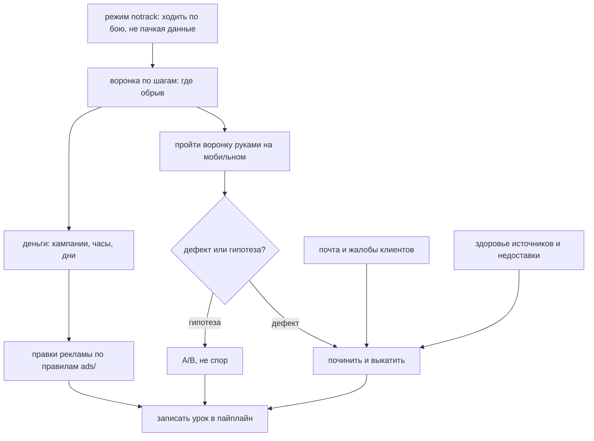

# Operate web product — живой продукт: где течёт и что чинить первым

> **Status: PROVEN (ЧистаяСделка, 28–29.07.2026).** Выведен из суток работы с
> продуктом, который уже принимал деньги: 2 640 визитов, 46 оплат, 41 834 ₽
> расхода на рекламу. За один проход нашлись: четыре заглушки, полностью
> запиравшие оплату; две «нулевые» рекламные кампании, оказавшиеся лучшими;
> апселл, бравший деньги за заведомо невыполнимую проверку; три клиентских
> письма, пролежавших без ответа четверо суток.

## Что делает и когда за ним идти

Каталог покрывает путь **идея → бриф → MVP → домен → деплой → юр-обвязка →
платежи → аналитика → реклама**. И обрывается там, где начинается самое дорогое:
продукт живой, деньги идут, и надо понять, **где именно течёт и что чинить
первым**.

Этот сценарий — про фазу после запуска. Берись за него, когда есть боевой
трафик и хотя бы десяток оплат: раньше данных не хватит, чтобы отличить
закономерность от шума.

Он не про «сделать лучше вообще». Он про порядок, в котором смотреть, чтобы не
чинить косметику, пока рядом заперта оплата.

**Что должно быть сделано до него:** `product-to-web-mvp.md` (продукт работает),
`site-analytics.md` (счётчик, цели, привязка к кампаниям), платежи и юр-обвязка.
Без своего реестра оплат и без событий воронки шаги 1 и 4 читать нечем.

## Поток

Читать так: `notrack` — всегда первым, иначе собственные проверки испортят те
самые числа. Дальше три ветки независимы и идут параллельно — **воронка**,
**деньги** и **входящие сигналы** (почта, здоровье источников). Сходятся в
починке, а починка обязана закончиться записью урока, иначе следующий проект
пройдёт тот же путь заново.

## Шаг 0. Режим «не считать меня»

Прежде чем что-либо трогать, включите `/?notrack=1`. Без этого каждая ваша
проверка боевого пути ломает конверсию, воронку и плечи A/B — те самые числа,
ради которых всё и затевалось. Подробности в `analytics/README.md`, правило 15.

Проверка, что работает: открыть дашборд, запомнить визиты, полистать сайт,
обновить дашборд — счётчик не двинулся.

## Шаг 1. Воронка по шагам

Не «конверсия 1,5%», а поштучно каждый переход. Утечка почти никогда не там,
где кажется.

Живой пример — что показала ЧистаяСделка:

| Шаг | Людей | Потеря |
|---|---|---|
| Зашли | 2 640 | |
| Ввели объект | 996 | −62% |
| Дождались превью | 996 | — |
| Нажали «Проверить» | 557 | −44% |
| Ввели email | 302 | −46% |
| Ввели ФИО | 118 | −61% |
| Экран оплаты | 94 | |
| Нажали оплатить | 38 | −60% |

Читается сразу: обрывов четыре, и три из них — до того, как человек впервые
увидел цену. Это уже гипотеза, а не гадание.

**Что вычеркнуть до того, как думать.** Отвал на ожидании: из 683 ждавших
превью ушёл **один**, медиана 5 секунд. «Долго грузится» можно закрыть и не
возвращаться. Дочитывание: до тарифов долистали 8 человек из 2 640 — значит всё,
что ниже первого экрана, на решение не влияет и переписывать его бессмысленно.

## Шаг 2. Пройти воронку руками, на мобильной ширине

Это единственный шаг, который нельзя заменить чтением кода или цифр. Открыть
390 пикселей и пройти путь целиком, как человек.

Что нашлось только так:

- **четыре заглушки**, запиравшие оплату, когда бесплатный источник не опознал
  объект. Три в вёрстке, одна — 400 на сервере. Каждая с виду разумная;
  вместе — наглухо закрытая касса
- **вёрстка, съедавшая границу поля** и накрывавшая тенью текст согласия
- **противоречия в текстах**: «объект подтверждён» там, где не подтверждён;
  «принят в ЕГРН» там, где ЕГРН его не нашёл
- **пример отчёта, споривший сам с собой**: стрелка на зелёном и «рисков не
  обнаружено», а строкой ниже ипотека банка

Ни одно из этого не видно ни в метриках, ни в логах.

## Шаг 3. Отделить дефект от гипотезы

Самая частая ошибка — спорить о том, что можно измерить, и измерять то, что
просто сломано.

**Дефект** — кнопка не работает, оплата заперта, текст врёт. Чинится сразу, без
обсуждения и без A/B.

**Гипотеза** — «цена спрятана до четвёртого шага», «пример отчёта слишком
благополучный», «заголовок не про тот объект». Проверяется тестом, а не
убеждением. Спорить о том, что дешевле измерить, — потеря времени.

**И проверяйте измерение, прежде чем верить измерению.** Дважды за сутки я
объявил поломкой то, что работало: «прокрутка к галочке не срабатывает» (мерил
прокрутку окна, а модалка скроллится внутри себя) и «сегмент браузера не платит»
(нормальный сегмент, просто мало данных). Ложная тревога стоит доверия к
остальным находкам.

## Шаг 4. Деньги: кампании, часы, дни

Три разреза, в таком порядке.

**По кампаниям — по своему реестру, не по панели Директа.** Директ не знает про
апселлы и возвраты, а при неподключённом счётчике не знает вообще ничего. У нас
две «нулевые» кампании дали 33 оплаты из 46. См. `ads/README.md`, раздел про
счётчик.

**По часам.** Почасового расхода в API нет — оценивается распределением
фактического расхода по рекламным визитам из Метрики. У нас: 82% оплат в окне
08:00–17:00, ночь 01:00–06:00 — ноль оплат при ~9 000 ₽ в месяц расхода, вечер
18:00–24:00 — 12 761 ₽ в неделю против 2 216 ₽ выручки.

**По дням.** Одной недели мало для выводов по дням недели: каждый день
представлен единожды, и «среда — 1 оплата» окажется просто первым днём работы.

Правки рекламы — строго по правилам из `ads/README.md`: что перезапускает
обучение, что траты, и почему бюджет трогают только в начале недели.

## Шаг 5. Входящие сигналы

Две вещи, которые продукт сообщает сам, если его слушать.

**Почта.** Обращения клиентов — прямая наводка на дефекты. У нас три письма
пролежали без ответа четверо суток просто потому, что о них никто не знал:
приёмник складывал их в папку на диске. Уведомления в телеграм ставятся вместе
с приёмником, см. `mailer/README.md`.

**Здоровье источников.** Если продаёте данные — считайте долю проверок, где
источник промолчал, по дням. У нас 6,5% оплаченных отчётов уходили без главной
проверки, и узнавали мы это из жалоб.

**Недоставленное.** Отдельно: оплаты, по которым продукт не выдан. Это самые
дорогие деньги в системе — они уже получены и в любой момент могут стать
возвратом.

## Шаг 6. Записать урок

Починили — запишите в тот пайплайн, которому урок принадлежит. Не в конец
чата и не в голову.

- продуктовое поведение (не запирать оплату, спрашивать письмом) → `gen-web-mvp`
- деньги и чеки → `add-payments`
- согласия и ПДн → `golive-legal`
- сбор данных, срезы, режимы → `analytics/README.md`
- реклама → `ads/README.md`
- почта → `mailer/README.md`

Правило простое: **если урок стоил денег или часа работы — он стоит трёх строк
в README.** Иначе следующий проект купит его заново.

## Гочи

- **Проверять на боевом, а не на макете.** Локальный стенд отвечает заглушкой:
  у нас он на любой адрес возвращал одну и ту же квартиру в Калуге, и это
  неотличимо от тяжёлого бага прода. Вёрстку — на стенде, поведение — только
  на бою с `notrack`.
- **Инструменты автоматизации врут про прокрутку и анимацию.** В непрорисованной
  вкладке не работают `IntersectionObserver`, `requestAnimationFrame` и плавная
  прокрутка. Прежде чем объявлять поломку — проверьте, что меряете.
- **Сначала деньги, потом красота.** Отрицательный баланс рекламного кабинета
  и «до остановки 0 дней» обесценивают любые настройки, сделанные в тот же день.
- **Не чинить и тестировать одновременно.** Правка кампании в середине теста
  смешивает «до» и «после» в одном отчёте.
- **Одна неделя — не данные.** Ноль оплат в конкретный час при 2 300 ₽ расхода
  почти наверняка случайность. Понижать ставки можно, отключать — рано.
