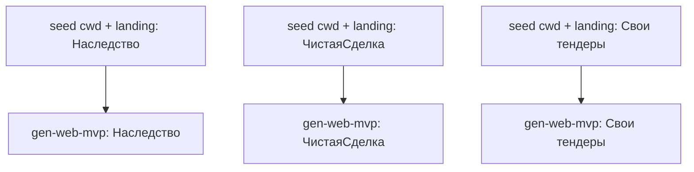

# Product → web MVP — brief + landing to a running product

> **Status: reference recipe (new 2026-07-03).** First instance builds three
> lead-validation products (Наследство.Про, ЧистаяСделка, Свои тендеры) from
> pre-made landings. Driver: `.hq/_runtime/scenarios/<run>/scenario.ts`
> (resumable; per-product checkpoints).

## What it accomplishes / when to reach for it

Turns a **product brief + an already-designed landing page** into a **real,
runnable web MVP** — a working product with a genuine end-to-end flow, not a
stub that just collects contacts. Reach for it when you have validated the
messaging (the landing) and now want the thing behind the CTA to actually work,
cheaply, so you can put real traffic on it and measure conversion to a real
action (document generated, report produced, feed delivered) instead of just an
email capture.

One product needs only the single `gen-web-mvp` pipeline (use the `run` skill
directly). This is a **scenario** because we build **several products at once**,
each seeded with its own landing and brief, and want one resumable run that
survives a failure in any single build.

## The flow

Read it as: the three products are **independent** — no arrows between them, so
they may run concurrently, or sequentially to build the OCI image once and reuse
it (the first `gen-web-mvp` run builds the `gen-web-mvp` image via nix; later
runs reuse the cached image). Each product's chain is: seed the target dir with
its landing → run `gen-web-mvp`, whose OWN internal QA gate re-runs the build
until the MVP's smoke test passes (or fails the run after `attempts`). There is
no separate verify step in the scenario — the gate lives inside the pipeline.

## Pipelines used

- **gen-web-mvp** — the coding-agent pipeline that builds one MVP into a cwd
  from a `brief` (+ the `landing` file seeded into cwd) and self-verifies by
  running a smoke test. Args: `{ brief, cwd (ABSOLUTE), landing (filename in
  cwd, default landing.html), attempts }`. Its build doctrine
  (config.run.systemPromptAppend) enforces: real domain logic, runs with no paid
  keys, honest fallbacks (never fabricated data), no dark patterns, RUN.md +
  SMOKE.md deliverables.

## Inputs / per-product mapping (first instance, 2026-07-03)

| Product | home (in workspace) | landing source | brief gist |
|---|---|---|---|
| Наследство.Про | `projects/nasledstvo/worktrees/main` | `landings/nasledstvo/v3-classic.html` | опросник → срок по ст.1154 ГК → заявление нотариусу (.docx/PDF) → долги по ЕФРСБ |
| ЧистаяСделка | `projects/sdelka/worktrees/main` | `landings/sdelka/v2-product.html` | ФИО+кадастр → ЕФРСБ/ФССП → LLM/rule вердикт риска → PDF-отчёт |
| Свои тендеры | `projects/tendery/worktrees/main` | `landings/tender/v2-live.html` | профиль → фетч zakupki.gov.ru → отбор+выжимка → веб-лента (+TG-бот) |

## Gotchas / how to resume

- **NO external cwd — build in scratch, relocate into the workspace.** On
  Docker-Desktop hosts, overlay-mounting an external `cwd` (a path outside the
  workspace root) breaks the Claude Agent SDK binary launch (fails at ~30s,
  "native binary failed to launch" — reproduces on the stock `agent` pipeline
  too). So gen-web-mvp takes NO cwd: it builds into its per-run scratch
  workspace (inside the artifact tree, which IS inside the mounted workspace),
  and the driver copies the result into `projects/<name>/worktrees/main`.
- **Stage the landing UNDER the workspace.** The landing must be readable
  in-container, i.e. beneath the workspace root — the driver copies it to
  `inputs/<name>/landing.html` inside this run dir and passes that absolute path
  as `landing`. An external path (e.g. `~/Desktop/...`) is NOT visible in-container.
- **Project home is a LOCAL git repo, no remote yet.** The driver `git init`s
  `projects/<name>/worktrees/main` and commits locally. It does NOT create a
  GitHub repo or `git submodule add` — that exposes the URL in `.gitmodules` and
  is the user's access decision. Convert to a proper submodule once the remote
  is chosen.
- **First run builds the nix image** for gen-web-mvp (chromium + git + uv; NO
  baked python/node — that closure breaks the SDK binary launch; uv provisions a
  standalone CPython at runtime). Run products **sequentially the first time** so
  the image builds once.
- **Resumable:** each product writes a `.done/<product>` marker on success; a
  re-run skips completed products and retries only the failed one. gen-web-mvp
  itself is idempotent per `run` name (same name overwrites step outputs).
- **Cost:** each product is an Opus coding agent + an Opus QA reviewer that runs
  the smoke test, with up to `attempts` build cycles. This is the expensive
  phase — run it deliberately, not on every edit.

## What comes after

The MVP running is not the finish line. Once it takes real traffic and real
payments, switch to **`operate-web-product.md`** — the operate-phase recipe:
reading the funnel step by step, separating defects from hypotheses, touching
ads without wrecking the data, and testing prod without polluting stats.
